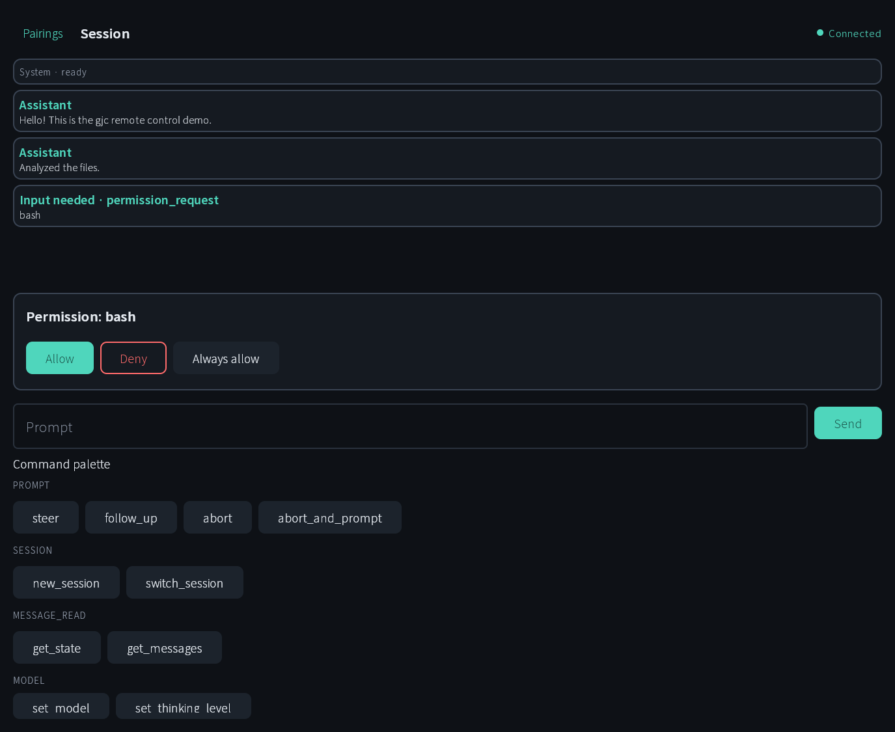

# gajae-deck

A **Compose Multiplatform** companion app for remote-controlling the
[gajae-code (gjc)](https://github.com/probepark/gajae-deck) coding agent over its
**Bridge protocol v2**. Run the agent on your workstation, then watch its
transcript, answer permission/input gates, and drive commands from your phone,
browser, or desktop.

The repo ships two pieces:

- **`shared/` + `androidApp/`** — the Kotlin Multiplatform client UI (Android,
  Desktop/JVM, iOS, and wasmJs in the browser).
- **`supervisor/`** — a Bun/TypeScript single-operator control plane that
  orchestrates `gjc --mode bridge` subprocesses, exposes a control API, reverse-
  proxies streaming routes, and sends alias-only push notifications when the
  agent needs input.

> **Privacy by construction:** logs, metrics, push payloads, persisted state, and
> navigation routes only ever contain opaque hashes/aliases — never your cwd,
> repo names, prompts, command args, or tokens.

## Screenshots

The session view running in the browser (wasmJs) demo — streamed transcript, an
inline `permission_request` gate, prompt input, and the scope-gated command
palette:



> Native iOS/Android captures will be added once those targets are run on a
> device/simulator. Additional render evidence lives in
> [`docs/e2e/`](docs/e2e/README.md).

## Features

- **One client, four targets** — a single `App()` composable runs on Android,
  Desktop, iOS, and the browser (wasmJs).
- **Live session view** — streamed transcript (messages, tool calls, notices),
  prompt input, and a scope-gated command palette.
- **Gate handling** — answer `permission_request` / `workflow_gate` / `ui_request`
  and other user-input gates inline; fail-closed (never responds to a
  non-negotiated gate).
- **Secure storage** — encrypted, OS-backed `SecureStore` per platform
  (EncryptedSharedPreferences, Keychain, file-based desktop store, browser
  localStorage with a lower-assurance warning).
- **Push to continue** — the supervisor emits alias-only APNs/FCM notifications
  when the agent hits a gate, with a deep link back into the app.

## Architecture

```
 KMP app  ──/control/v1/*──▶  supervisor  ──spawns──▶  gjc --mode bridge
   │                          (Bun/TS)                  (HTTPS, protocol v2)
   └──/s/{routeId}/v1/*──────▶  proxy  ──────────────▶  (SSE/NDJSON stream)
```

- **Control plane** (`/control/v1/*`): list projects, start/stop/respawn
  sessions, register push devices. Authenticated by a control bearer token.
- **Data plane** (`/s/{routeId}/v1/*`): the app streams events through the
  supervisor's reverse proxy, which validates an opaque, scoped route token
  **before** contacting the bridge, then rewrites auth and streams unbuffered.
- The bridge sends **no CORS headers**, so the browser target needs a same-origin
  reverse proxy — see `ops/web-proxy/` (Caddy).

For a deeper map of modules, conventions, and contracts, see
[`AGENTS.md`](AGENTS.md) and the frozen specs under
[`docs/v2/`](docs/v2) and [`docs/bridge/`](docs/bridge).

## Project structure

| Path | Purpose |
|------|---------|
| `shared/src/commonMain/` | Nearly all client logic + Compose UI (`ui/`, `bridge/`, `control/`, `navigation/`, `auth/`, `settings/`, `di/`) |
| `shared/src/{android,desktop,ios,wasmJs}Main/` | Platform `actual`s only (Ktor engine, SecureStore, Koin bindings) |
| `androidApp/` | Thin Android host (Application + Activity) |
| `supervisor/` | Bun/TypeScript control plane (`server.ts` entry) |
| `ops/web-proxy/` | Caddy same-origin proxy + launchd templates |
| `docs/` | ADRs, v2/bridge contracts, E2E evidence |

## Requirements

- **JDK 21** (Desktop target is `JVM_21`; Android uses `JVM_11`).
- **Android SDK** with API 36 (`minSdk 26`), for the Android target.
- **Bun 1.3.14** (pinned), for the supervisor.
- **Xcode** + an iOS simulator, for the iOS target.
- The Gradle wrapper (`./gradlew`, pinned to 9.5.1) handles the rest.

## Getting started

### Client

```sh
# Android (debug install on a connected device/emulator)
./gradlew :androidApp:installDebug

# Desktop (JVM)
./gradlew :shared:run

# Web (wasmJs) dev server
./gradlew :shared:wasmJsBrowserDevelopmentRun

# iOS framework (open the simulator from Xcode/Compose tooling)
./gradlew :shared:linkDebugFrameworkIosSimulatorArm64
```

The web build needs the Caddy same-origin proxy to reach the bridge — see
[`ops/web-proxy/README.md`](ops/web-proxy/README.md).

### Supervisor

```sh
cd supervisor
bun install
bun run server.ts        # starts on 127.0.0.1:8787 by default
```

The supervisor spawns the `gjc` bridge; applying the opt-in
[`patches/gjc-bridge-endpoints.md`](patches/gjc-bridge-endpoints.md) enables the
session endpoints the client needs.

## Testing

```sh
# Shared KMP tests (all targets)
./gradlew :shared:allTests
# Desktop/JVM only
./gradlew :shared:desktopTest

# Supervisor
cd supervisor && bun test && bun run typecheck
```

A guarded live-bridge E2E runs only when env vars are set, so default builds stay
deterministic:

```sh
GJC_BRIDGE_E2E=1 GJC_BRIDGE_TOKEN=<token> GJC_BRIDGE_BASE=https://127.0.0.1:4077 \
  ./gradlew :shared:desktopTest --tests '*LiveBridgeE2eTest*'
```

## Localization

The default UI strings (`shared/src/commonMain/composeResources/values/strings.xml`)
are English; a Korean locale lives in `values-ko/`. The app bundles a subset of
the Noto Sans KR variable font to render Hangul + Latin on the skiko (Desktop/Web)
targets.

## License

Third-party notices are in [`NOTICE`](NOTICE) — the bundled Noto Sans KR font is
licensed under the SIL Open Font License 1.1.
